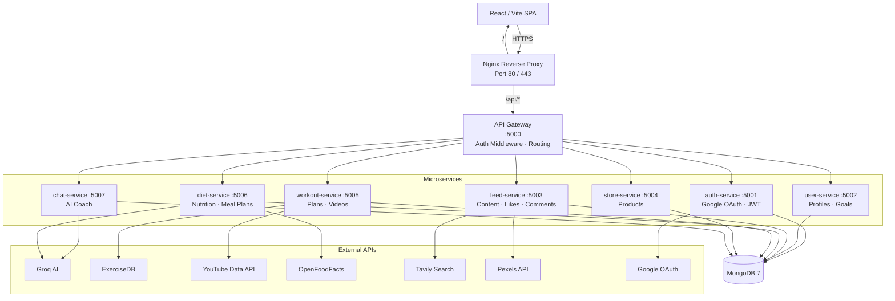
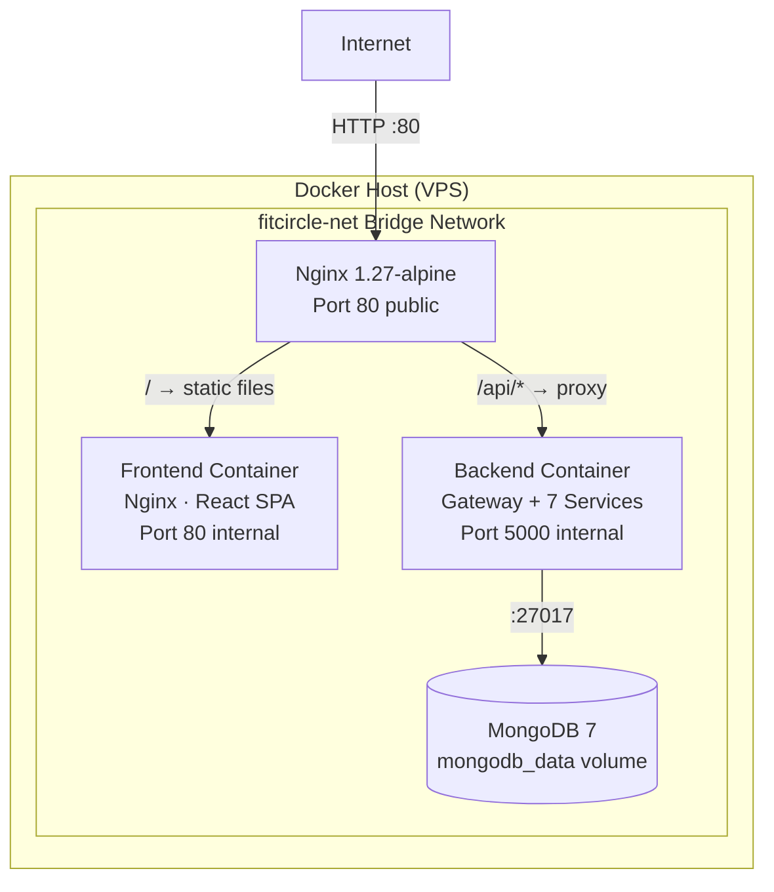
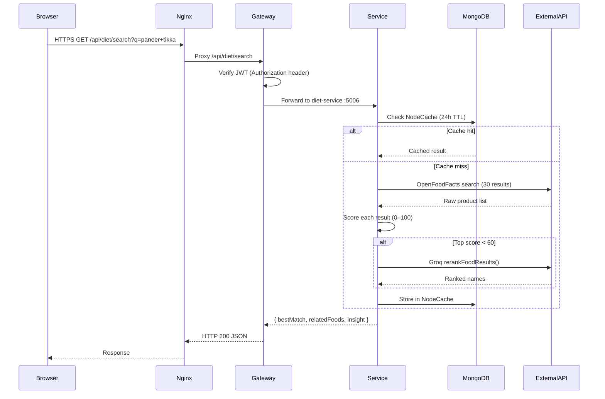
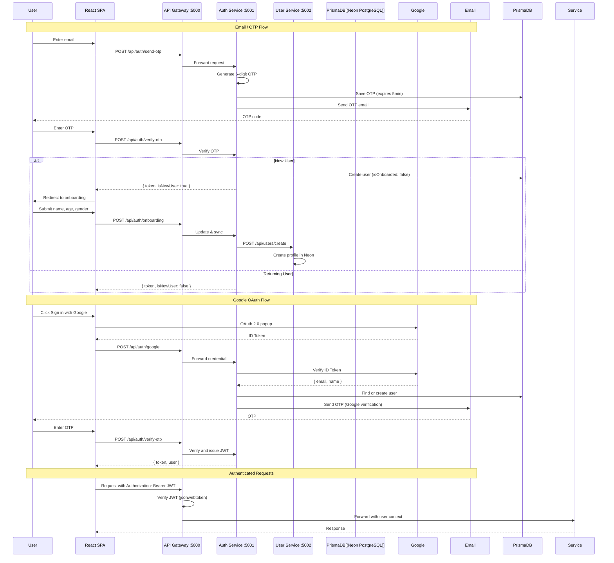
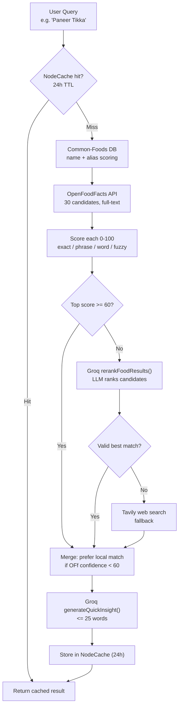
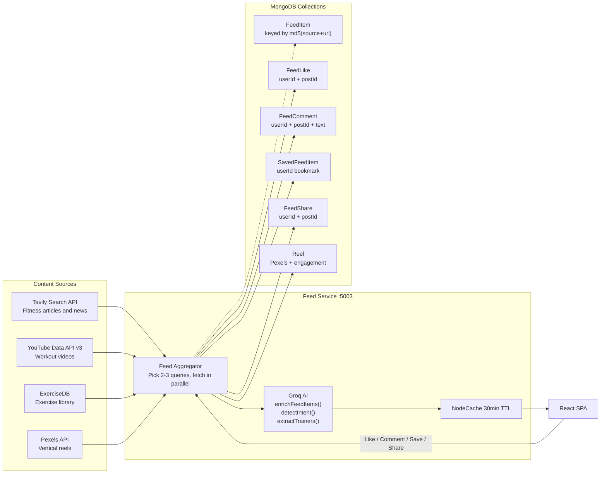
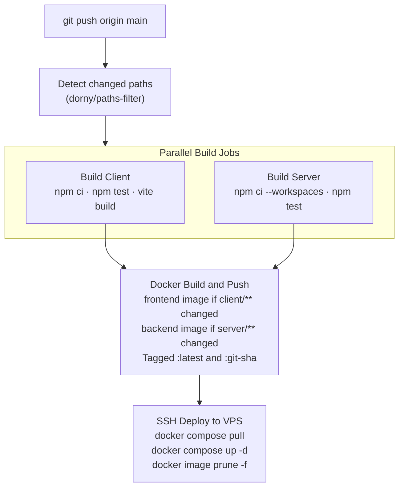
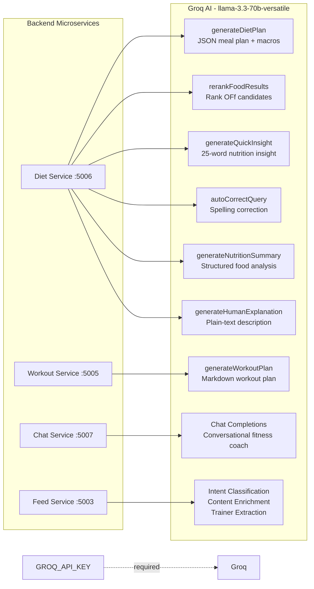

# FitCircle Pro


An AI-powered fitness platform built on a Node.js microservices architecture. FitCircle Pro integrates nutrition search, AI-generated workout and diet plans, real-time fitness content aggregation, and an AI coaching chat — all behind a single API gateway.

---

## Table of Contents

- [Overview](#overview)
- [Key Features](#key-features)
- [Architecture](#architecture)
- [Service Reference](#service-reference)
- [Request Flow](#request-flow)
- [Technology Stack](#technology-stack)
- [Repository Structure](#repository-structure)
- [Environment Variables](#environment-variables)
- [Local Development](#local-development)
- [Docker Setup](#docker-setup)
- [CI/CD Pipeline](#cicd-pipeline)
- [API Integrations](#api-integrations)
- [Security](#security)
- [Roadmap](#roadmap)
- [Author](#author)

---

## Overview

FitCircle Pro is a full-stack fitness SaaS platform structured as a Node.js monorepo with npm workspaces. Each business domain runs as an independent Express service registered behind a central API gateway. The frontend is a Vite/React SPA served through an Nginx reverse proxy.

The system is designed to run entirely in Docker with a three-container production topology: `nginx`, `backend` (gateway + all services), and `mongodb`. GitHub Actions handles build validation, Docker image publishing, and zero-downtime deployment to a VPS.

---

## Key Features

| Domain | Feature |
|--------|---------|
| Nutrition | OpenFoodFacts full-text search with per-result scoring (0–100) and Groq AI reranking fallback |
| Diet Planning | AI-generated personalized meal plans with macro targets, shopping lists, and markdown export |
| Workouts | ExerciseDB exercise library, YouTube workout video search with real duration data, AI plan generation |
| Feed | Fitness content aggregation from Tavily search and YouTube, persisted in MongoDB with real like/comment/bookmark/share counts |
| Social | Reels viewer powered by Pexels video API, community posts, story viewer |
| AI Coach | Groq-powered conversational fitness coach via chat-service |
| Auth | Google OAuth + JWT, middleware applied at the gateway level |
| Store | Fitness product discovery and recommendations |

---

## Architecture




## Comprehensive System Architecture

```mermaid
graph TB
    %% ── Layer 1: Client ──
    subgraph Client["Client Layer"]
        Browser["Browser / React SPA<br/>Vite · TanStack Query · Framer Motion"]
    end

    %% ── Layer 2: Edge ──
    subgraph Edge["Edge Layer"]
        Nginx["Nginx Reverse Proxy<br/>Port 80 · 30 req/s rate limit<br/>Security headers · Gzip · WebSocket upgrade"]
    end

    %% ── Layer 3: Gateway ──
    subgraph GW["API Gateway Layer"]
        Gateway["Express Gateway · Port 5000<br/>JWT verification · CORS · Route proxy"]
    end

    %% ── Layer 4: Microservices ──
    subgraph Services["Microservices (single container · ports 5001-5007)"]
        Auth["auth-service :5001<br/>Google OAuth · OTP · JWT · Admin"]
        User["user-service :5002<br/>Profiles · Avatars · Settings"]
        Feed["feed-service :5003<br/>Content aggregation · Likes/Comments<br/>Saved items · Reels · Stories"]
        Store["store-service :5004<br/>Cart · Orders · Products"]
        Workout["workout-service :5005<br/>Exercise library · Videos · Plans"]
        Diet["diet-service :5006<br/>Food search · Meal plans · Nutrition AI<br/>Meal logging · BMI/BMR/TDEE"]
        Chat["chat-service :5007<br/>AI coaching · 8 agents · WebSocket"]
    end

    %% ── Layer 5: Databases ──
    subgraph DB["Database Layer"]
        Neon[("Neon PostgreSQL<br/>auth-service · user-service · store-service<br/>via Prisma ORM")]
        Mongo[("MongoDB 7<br/>feed-service · workout-service<br/>diet-service · chat-service<br/>via Mongoose ODM")]
    end

    %% ── Layer 6: External APIs ──
    subgraph Ext["External API Integrations"]
        Google["Google OAuth 2.0<br/>ID Token / Access Token"]
        Groq["Groq AI · llama-3.3-70b-versatile<br/>Plan generation · Search rerank<br/>Food analysis · Agent chat<br/>Content enrichment · Intent detection"]
        OFF["OpenFoodFacts<br/>Product search · Barcode lookup<br/>Full-text search · 30 results"]
        YT["YouTube Data API v3<br/>Video search · Duration · Statistics"]
        Tavily["Tavily Search API<br/>Web articles · Nutrition fallback"]
        Pexels["Pexels Video API<br/>Fitness reels · Vertical clips"]
        ExDB["ExerciseDB<br/>Exercise library · Body parts<br/>Target muscles · Equipment"]
        Reddit["Reddit API<br/>Fitness subreddit hot posts"]
        Cloud["Cloudinary<br/>Profile images · Post media"]
        Email["Nodemailer / Gmail SMTP<br/>OTP email delivery"]
    end

    %% ════════════════════════════════════════════
    %% CONNECTIONS
    %% ════════════════════════════════════════════

    %% Client → Edge → Gateway
    Browser -->|"HTTPS"| Nginx
    Nginx -->|"/ → static files (SPA)"| Browser
    Nginx -->|"/api/* → proxy pass :5000"| Gateway
    Nginx -->|"/health"| Gateway
    Nginx -->|"WebSocket Upgrade → :5007"| Chat

    %% Gateway → Services
    Gateway -->|"/api/auth/*"| Auth
    Gateway -->|"/api/users/* (incl. multipart)"| User
    Gateway -->|"/api/feed/* /api/explore/*"| Feed
    Gateway -->|"/api/store/* /api/products/*"| Store
    Gateway -->|"/api/workouts/*"| Workout
    Gateway -->|"/api/diet/*"| Diet
    Gateway -->|"/api/chat/*"| Chat

    %% Services → Databases
    Auth -->|"Prisma · User, OTP models"| Neon
    User -->|"Prisma · UserProfile model"| Neon
    Store -->|"Prisma · Cart, CartItem, Order models"| Neon

    Feed -->|"Mongoose · FeedItem, FeedLike, FeedComment,<br/>FeedShare, SavedFeedItem, Post, Reel, Story"| Mongo
    Workout -->|"Mongoose · Workout, WorkoutPlan"| Mongo
    Diet -->|"Mongoose · Meal, FoodLog, DietPlan"| Mongo
    Chat -->|"Mongoose · Message"| Mongo

    %% Services → External APIs
    Auth -->|"verifyIdToken() / userinfo endpoint"| Google
    Auth -->|"sendMail() OTP"| Email

    User -->|"multer-storage-cloudinary"| Cloud
    Feed -->|"multer-storage-cloudinary"| Cloud

    Diet -->|"search_simple=0, page_size=30"| OFF
    Store -->|"search + barcode lookup"| OFF

    Diet -->|"searchNutritionWeb() fallback"| Tavily
    Feed -->|"searchTavily() articles"| Tavily

    Feed -->|"searchPexels() reels"| Pexels

    Workout -->|"exercises/name, bodyPart, target"| ExDB
    Feed -->|"exercises/name query"| ExDB

    Workout -->|"search + videos (contentDetails)"| YT
    Feed -->|"searchYoutube() videos"| YT

    Feed -->|"hot.json fitness subreddits"| Reddit

    Diet -->|"generateDietPlan, rerankFoodResults,<br/>generateQuickInsight, autoCorrectQuery,<br/>generateNutritionSummary, askNutritionAI"| Groq
    Workout -->|"generateWorkoutPlan"| Groq
    Chat -->|"agent completions · 8 agents"| Groq
    Feed -->|"detectIntent, enrichFeedItems,<br/>extractTrainersFromSearch"| Groq

    %% Inter-service Communication
    Auth -.->|"check profile · sync onboarding<br/>admin profiles · delete profile"| User
    Feed -.->|"enrich posts with user data"| User
    Feed -.->|"nutrition search in explore"| Store

    %% Legend
    linkStyle 0,1,2,3,4 stroke-width:2px,stroke:#2563eb
    linkStyle 5,6,7,8,9,10,11 stroke-width:2px,stroke:#2563eb
    linkStyle 12,13,14,15,16,17,18 stroke-width:1px,stroke:#16a34a
    linkStyle 19,20,21,22,23,24,25,26,27,28,29,30,31,32,33,34,35,36 stroke-width:1px,stroke:#9333ea
    linkStyle 37,38,39 stroke-width:1px,stroke:#dc2626,stroke-dasharray:5 5
```



---



**Startup order** (enforced via `depends_on` + health checks): MongoDB → Backend → Frontend → Nginx.

---

## Service Reference

<details>
<summary><strong>gateway/</strong> — API Gateway · Port 5000</summary>

The single entry point for all client requests. Handles JWT verification, injects user context into forwarded headers, and proxies requests to the appropriate downstream service using `http-proxy-middleware`.

| Responsibility | Notes |
|----------------|-------|
| Route resolution | `/api/auth/*` → auth-service, `/api/feed/*` → feed-service, etc. |
| Auth middleware | Validates `Authorization: Bearer <token>` on protected routes |
| Health endpoint | `GET /health` — used by Docker and Nginx health checks |
| CORS | Configured for the frontend origin via `CLIENT_URL` |

</details>

<details>
<summary><strong>auth-service/</strong> — Authentication · Port 5001</summary>

Manages user authentication flows. Issues and verifies JWTs. Supports both Google OAuth (via Passport.js) and standard email/password login.

| Responsibility | Notes |
|----------------|-------|
| Google OAuth | `passport-google-oauth20`, redirect flow |
| JWT issuance | Signed with `JWT_SECRET`, configurable expiry |
| Session management | Stateless — tokens stored client-side |

</details>

<details>
<summary><strong>user-service/</strong> — User Profiles · Port 5002</summary>

Stores and manages user profile data, fitness goals, and preferences in MongoDB. Internal APIs are called by the gateway and other services to resolve user context.

| Responsibility | Notes |
|----------------|-------|
| Profile CRUD | Name, avatar, bio, fitness goals |
| Goal tracking | Weight targets, activity level, diet type |
| Avatar upload | Via Cloudinary integration |

</details>

<details>
<summary><strong>diet-service/</strong> — Nutrition & Diet Plans · Port 5006</summary>

The most complex search-heavy service. Implements a multi-stage food search pipeline and AI diet plan generation.

**Search pipeline:**

```
Query: "Paneer Tikka"
    → OpenFoodFacts (30 candidates, full-text, search_simple=0)
    → Score each result 0–100 (exact / phrase / word / fuzzy)
    → score ≥ 60: fast path — use top result
    → score < 60: Groq rerankFoodResults() — LLM ranks candidates
    → { bestMatch, relatedFoods[], insight }
    → 24-hour NodeCache
```

| Responsibility | Notes |
|----------------|-------|
| Food search | OpenFoodFacts API → scored → Groq reranked |
| Fallback | Tavily web search when OFf returns no usable data |
| AI diet plans | Groq `llama-3.3-70b-versatile` → JSON meal plan with macros |
| AI insights | Quick 25-word nutrition insight per food query |
| Meal logging | Stored in MongoDB per user |

</details>

<details>
<summary><strong>workout-service/</strong> — Workouts & Exercise Library · Port 5005</summary>

Serves the exercise explorer and workout video feed. Fetches real exercise data from ExerciseDB and real video durations from YouTube Data API.

| Responsibility | Notes |
|----------------|-------|
| Exercise library | ExerciseDB — filter by body part, target, equipment |
| Video search | YouTube Data API v3 — `snippet` + `contentDetails` + `statistics` |
| Duration parsing | ISO 8601 `PT15M30S` → `15:30` |
| AI workout plans | Groq-generated markdown workout plans |
| Plan management | Save, list, download, delete user plans |

</details>

<details>
<summary><strong>feed-service/</strong> — Fitness Content Feed · Port 5003</summary>

Aggregates fitness content from Tavily and YouTube, persists it in MongoDB as `FeedItem` documents, and tracks engagement per item.

| Responsibility | Notes |
|----------------|-------|
| Content aggregation | Tavily search + YouTube, keyed by `md5(source+url)` |
| Likes | `FeedLike` collection — unique per user+post, real counts |
| Comments | `FeedComment` collection — paginated, newest first |
| Bookmarks | `SavedFeedItem` collection — per-user saved feed |
| Share tracking | `FeedShare` collection — idempotent |
| Reels | Pexels video API — vertical workout clips |

</details>

<details>
<summary><strong>store-service/</strong> — Fitness Products · Port 5004</summary>

Handles fitness product discovery, listings, and user-facing product recommendations. Backed by MongoDB.

</details>

<details>
<summary><strong>chat-service/</strong> — AI Fitness Coach · Port 5007</summary>

Real-time conversational fitness coaching using Groq's `llama-3.3-70b-versatile` model. Supports WebSocket connections proxied through Nginx.

| Responsibility | Notes |
|----------------|-------|
| AI coaching | Groq streaming completions |
| Conversation history | Persisted in MongoDB per user |
| WebSocket | Nginx proxied with `Upgrade` headers |

</details>

---

## Request Flow



---

### Authentication Flow



---

### Diet Service Search Pipeline



---

### Feed Content Aggregation



---

## Technology Stack

### Frontend

| Technology | Version | Purpose |
|------------|---------|---------|
| React | 18 | UI framework |
| Vite | 5 | Build tool and dev server |
| React Router | 6 | Client-side routing |
| TanStack Query | 5 | Server state, infinite scroll |
| Framer Motion | 11 | Animations |
| Lucide React | — | Icon library |
| Sonner | — | Toast notifications |
| date-fns | — | Date formatting |

### Backend

| Technology | Version | Purpose |
|------------|---------|---------|
| Node.js | 22 LTS | Runtime |
| Express.js | 4 | HTTP framework per service |
| npm Workspaces | — | Monorepo management |
| concurrently | 9 | Start all services in dev |
| Mongoose | 8 | MongoDB ODM |
| Passport.js | — | Google OAuth strategy |
| jsonwebtoken | — | JWT sign / verify |
| NodeCache | — | In-memory TTL cache |
| http-proxy-middleware | — | Gateway request proxying |
| Groq SDK | — | AI completions |
| Axios | — | HTTP client for external APIs |
| Multer + Cloudinary | — | File uploads |
| Nodemailer | — | Email |

### Infrastructure

| Component | Technology | Notes |
|-----------|-----------|-------|
| Reverse proxy | Nginx 1.27-alpine | Rate limiting, security headers, gzip, WebSocket |
| Containers | Docker | Multi-stage builds — `node:22-alpine` |
| Orchestration | Docker Compose | Dev: `docker-compose.yml` / Prod: `docker-compose.prod.yml` |
| CI/CD | GitHub Actions | Build → Docker push → SSH deploy |
| Image registry | Docker Hub | Tagged `:latest` and `:<git-sha>` |
| Database | MongoDB 7 | Persistent volume in production |

---

## Repository Structure

```
fitcircle-pro/
├── .github/
│   └── workflows/
│       └── ci-cd.yml               # Build → Docker push → Deploy
├── client/                         # React / Vite SPA
│   ├── src/
│   │   ├── api/                    # Axios instance + endpoint functions
│   │   ├── app/                    # Page-level components
│   │   │   ├── Home.jsx            # Feed, stories, reels
│   │   │   ├── Diet.jsx            # Nutrition search + plan generator
│   │   │   ├── Workout.jsx         # Video feed + exercise explorer
│   │   │   ├── Profile.jsx
│   │   │   └── components/         # Shared UI components
│   │   ├── context/                # AuthContext
│   │   ├── hooks/                  # Custom hooks
│   │   ├── layout/                 # App shell, navigation
│   │   └── pages/                  # Route-mapped pages
│   ├── Dockerfile                  # Multi-stage: build → nginx:alpine
│   └── .env.example
├── server/                         # Node.js monorepo (npm workspaces)
│   ├── gateway/                    # API Gateway — port 5000
│   ├── services/
│   │   ├── auth-service/           # :5001
│   │   ├── user-service/           # :5002
│   │   ├── feed-service/           # :5003
│   │   ├── store-service/          # :5004
│   │   ├── workout-service/        # :5005
│   │   ├── diet-service/           # :5006
│   │   └── chat-service/           # :5007
│   ├── Dockerfile                  # Multi-stage: all services in one image
│   ├── package.json                # Workspace root
│   └── .env.example
├── nginx/
│   └── nginx.conf                  # Rate limiting, security headers, gzip, SPA fallback
├── docker-compose.yml              # Development
├── docker-compose.prod.yml         # Production (pulls from Docker Hub)
└── README.md
```

---

## Environment Variables

### `client/.env`

Copy `client/.env.example` and fill in real values.

| Variable | Required | Description |
|----------|----------|-------------|
| `VITE_API_URL` | Yes | Backend gateway URL (e.g. `http://localhost:5000`) |
| `VITE_GOOGLE_CLIENT_ID` | Yes | Google OAuth 2.0 client ID |

### `server/.env`

Copy `server/.env.example` and fill in real values. This file is mounted into the production container — it must exist at `/opt/fitcircle/server/.env` on the VPS.

| Variable | Required | Description |
|----------|----------|-------------|
| `MONGO_URI` | Yes | MongoDB connection string |
| `JWT_SECRET` | Yes | Signing secret for JWTs (minimum 32 chars) |
| `GOOGLE_CLIENT_ID` | Yes | Google OAuth client ID |
| `GOOGLE_CLIENT_SECRET` | Yes | Google OAuth client secret |
| `GROQ_API_KEY` | Yes | Groq API key — used by diet-service and chat-service |
| `YOUTUBE_API_KEY` | Yes | YouTube Data API v3 key |
| `TAVILY_API_KEY` | Yes | Tavily search API key |
| `PEXELS_API_KEY` | Yes | Pexels video API key |
| `CLOUD_NAME` | Yes | Cloudinary cloud name |
| `CLOUD_API_KEY` | Yes | Cloudinary API key |
| `CLOUD_API_SECRET` | Yes | Cloudinary API secret |
| `EMAIL_USER` | Optional | Gmail address for Nodemailer |
| `EMAIL_PASS` | Optional | Gmail app password |
| `PORT` | Optional | Gateway port (default: `5000`) |
| `CLIENT_URL` | Yes | Allowed CORS origin (e.g. `http://localhost:5173`) |
| `AUTH_SERVICE` | Internal | `http://localhost:5001` |
| `USER_SERVICE` | Internal | `http://localhost:5002` |
| `FEED_SERVICE` | Internal | `http://localhost:5003` |
| `STORE_SERVICE` | Internal | `http://localhost:5004` |
| `WORKOUT_SERVICE` | Internal | `http://localhost:5005` |
| `DIET_SERVICE` | Internal | `http://localhost:5006` |
| `CHAT_SERVICE` | Internal | `http://localhost:5007` |

> Internal service URLs are pre-set in `docker-compose.prod.yml`. Override only if running services on separate hosts.

---

## Local Development

**Prerequisites:** Node.js 22+, MongoDB running locally or a MongoDB Atlas URI.

```bash
# 1. Clone
git clone https://github.com/your-username/fitcircle-pro.git
cd fitcircle-pro

# 2. Install backend dependencies (all workspaces)
cd server
npm install
cp .env.example .env
# Edit .env with your real API keys

# 3. Start all backend services concurrently
npm run dev
# Starts: gateway(:5000) auth(:5001) user(:5002) feed(:5003)
#         store(:5004) workout(:5005) diet(:5006) chat(:5007)

# 4. In a new terminal — install and start the frontend
cd ../client
npm install
cp .env.example .env
# Edit .env — set VITE_API_URL=http://localhost:5000
npm run dev
# Vite dev server starts at http://localhost:5173
```

Service logs are color-coded by service name in the terminal output.

---

## Docker Setup

### Development

Uses locally built images. Suitable for integration testing.

```bash
docker compose up --build
```

Services started: `mongodb`, `backend` (all services), `frontend`.  
No Nginx in development — frontend runs on `:5173`, backend on `:5000`.

### Production

Images are pulled from Docker Hub — nothing is built on the VPS.

```bash
# On the VPS — initial setup
git clone https://github.com/your-username/fitcircle-pro.git /opt/fitcircle
cd /opt/fitcircle
cp server/.env.example server/.env
# Fill in production secrets

# Start all containers
docker compose -f docker-compose.prod.yml up -d
```

**Container topology:**

| Container | Image | Exposed |
|-----------|-------|---------|
| `fitcircle-nginx` | `nginx:1.27-alpine` | `:80` (public) |
| `fitcircle-backend` | `dockerhub/fitcircle-backend:latest` | Internal `:5000` |
| `fitcircle-frontend` | `dockerhub/fitcircle-frontend:latest` | Internal `:80` |
| `fitcircle-mongodb` | `mongo:7` | Internal only |

All containers share the `fitcircle-net` bridge network. Only Nginx is exposed to the host. MongoDB data is persisted via a named volume (`mongodb_data`).

**Health checks** are configured on all containers. `docker-compose.prod.yml` uses `condition: service_healthy` to enforce startup order: MongoDB → Backend → Frontend → Nginx.

---

## CI/CD Pipeline



**Design decisions:**

- **Path filtering:** Docker build jobs only run for the changed half of the codebase. A pure frontend change does not rebuild the backend image, and vice versa.
- **Parallel builds:** Client and server build jobs run concurrently. Docker push waits for both.
- **No build on VPS:** The production server only runs `docker compose pull` + `up -d`. Build tools are not installed there.
- **Rollback:** Re-run the workflow on the previous commit SHA, or manually pull a specific tag: `docker pull youruser/fitcircle-backend:<previous-sha>`.
- **Watchtower removed:** Deployments are intentionally CI-driven. No automatic image polling.

**Required GitHub Secrets:**

| Secret | Description |
|--------|-------------|
| `DOCKERHUB_USERNAME` | Docker Hub username |
| `DOCKERHUB_TOKEN` | Docker Hub access token |
| `VPS_HOST` | VPS IP or hostname |
| `VPS_USER` | SSH username |
| `VPS_SSH_KEY` | Private SSH key (ED25519 recommended) |

---

### Groq AI Integration Map



---

## API Integrations

<details>
<summary><strong>Groq AI</strong></summary>

Model: `llama-3.3-70b-versatile`

Used in three contexts:

| Function | Service | Description |
|----------|---------|-------------|
| `generateDietPlan` | diet-service | Full JSON meal plan with macros, shopping list, and markdown export |
| `rerankFoodResults` | diet-service | Ranks OFf search candidates by relevance when confidence score is below 60 |
| `generateQuickInsight` | diet-service | 25-word nutrition insight per search query |
| `autoCorrectQuery` | diet-service | Spelling correction for food queries |
| `generateWorkoutPlan` | workout-service | Personalized markdown workout plan |
| AI coach completions | chat-service | Conversational fitness coaching |

API key: `GROQ_API_KEY`  
Rate limits: Groq free tier is sufficient for development.

</details>

<details>
<summary><strong>OpenFoodFacts</strong></summary>

Base URL: `https://world.openfoodfacts.org/cgi/search.pl`

Configuration used:

```
search_simple: 0    // full-text search — required for multi-word Indian dish names
page_size: 30       // more candidates improve reranking coverage
fields: code,product_name,generic_name,brands,image_url,nutriments
```

No API key required. Results are filtered for entries with a valid name and at least one non-zero nutrient value.

</details>

<details>
<summary><strong>ExerciseDB</strong></summary>

Base URL: `https://exercisedb.p.rapidapi.com`

Used in workout-service to power the exercise explorer. Supports filtering by body part, muscle target, and equipment. No API key is required for the public mirror version used here.

</details>

<details>
<summary><strong>YouTube Data API v3</strong></summary>

Two API calls per search request:

1. `GET /search` — returns video IDs and snippet data
2. `GET /videos?part=contentDetails,statistics` — returns real ISO 8601 duration and view count

Duration is parsed from `PT15M30S` format to human-readable `15:30`. Calorie estimate is derived from duration (`minutes × 7 kcal/min`).

API key: `YOUTUBE_API_KEY`  
Quota: Each search request consumes ~102 units. Monitor usage in Google Cloud Console.

</details>

<details>
<summary><strong>Tavily Search API</strong></summary>

Used in two services:

- **feed-service:** Aggregates fitness articles, trends, and exercise content for the Discover feed. Results are persisted in MongoDB as `FeedItem` documents, keyed by `md5(source+url)`.
- **diet-service:** Fallback when OpenFoodFacts returns no usable results for a query.

API key: `TAVILY_API_KEY`

</details>

<details>
<summary><strong>Pexels API</strong></summary>

Used in feed-service to serve the Reels section. Queries for portrait-orientation fitness videos. Results are enriched with like/comment data from the `Reel` MongoDB collection.

API key: `PEXELS_API_KEY` (set in the `Authorization` header, not a query param)

</details>

---

## Security

| Concern | Implementation |
|---------|---------------|
| Authentication | JWT verified at the gateway before forwarding to any service |
| Credential storage | Environment variables only — `.env` files are `.gitignore`d |
| Secrets in CI | GitHub Actions Secrets — never echoed in logs |
| CORS | Configured per-service and at the gateway with an explicit origin allowlist |
| Rate limiting | Nginx: 30 req/s per IP on `/api/`, burst of 60 |
| Security headers | `X-Frame-Options`, `X-Content-Type-Options`, `X-XSS-Protection`, `Referrer-Policy`, `Permissions-Policy` |
| Hidden files | Nginx blocks access to `.env`, `.git`, and all dotfiles (`location ~ /\.`) |
| Image uploads | Cloudinary — files never touch the application server |
| Password handling | bcrypt hashing via auth-service |
| Internal traffic | All inter-service communication is on the private Docker bridge network, never exposed to the host |

---

## Roadmap

- [ ] SSL/TLS via Let's Encrypt (Certbot) — Nginx config already has placeholder comments
- [ ] Unit and integration tests (Vitest + Supertest)
- [ ] User dashboard — weekly calorie/workout summary, streak tracking
- [ ] Push notifications — Web Push API
- [ ] AI Diet PDF export — generate and download a styled PDF meal plan
- [ ] Mobile PWA — manifest, offline support, install prompt
- [ ] Admin panel — user management, content moderation
- [ ] Horizontal scaling — separate backend containers per service with inter-container networking

---

## Author

**Rajesh Kayal**  
B.Tech Computer Science — Delhi Technological University  

[](https://github.com/rajesh-kayal-dev)

---

## License

This project is licensed under the MIT License.
